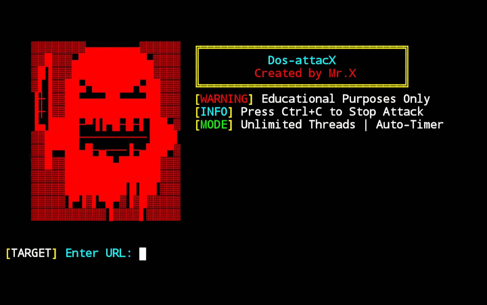

# Dos-attacX


## introduction
**Dos-attacX** is a framework designed for educational purposes to simulate a single-machine attack on a target's server. This tool sends continuous HTTP requests to overload the server's resources, potentially rendering it unresponsive. It is inspired by the concept of **DDoS (Distributed Denial of Service)** but operates with a single device.  

## Instalations
```
$ pkg update -y && pkg upgrade -y
$ apt update -y && apt upgrade -y
$ pkg install git
$ pkg install python -y
$ git clone https://github.com/Whomrx666/Dos-attacX.git
$ cd Dos-attacX
$ pip install -r requirements.txt
$ python Dos-attacX.py
```

## Instructions
- **first**: Install tools according to the instructions above
- **second**: Enter into tools
- **third**: Enter the target website address
- **Fourth**: Tools automatically perform ddos attacks
- **Last**: At the end the tool will describe all the results obtained from the initial attack.

## Features
- **Real-Time Statistics:** Track total requests, success rate, failed connections, and more.  
- **Interactive UI:** Built with the `rich` library for better user experience.  
- **Flexible Speed Configuration:** Customize delay between requests.  
- **Target Vulnerability Analysis:** Evaluate if the target is susceptible to the attack.  

# Result!


## Observation
This is a tool for education only, I am not responsible for any misuse
### Original Author
<a href="https://github.com/Whomrx666"></a>

### <<< If you copy , Then Give me The Credits >>>

## CONNECT WITH ME :

[](https://whomrxhackers.blogspot.com/)
[](https://twitter.com/whomrx666)
[](https://youtube.com/@whomrx666)
[](https://facebook.com/https://www.facebook.com/whomrx.666)
[](https://t.me/@Whomr_X)
[](mailto:whomrx666@gmail.com)
[](https://www.tiktok.com/@whomr.x)

**If you want to donate, click on the button**
<a href="https://saweria.co/whomrx"></a>

### Visitors :
